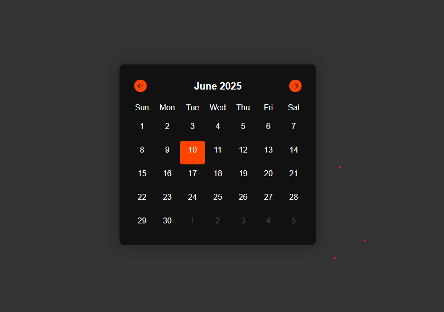

# Dark Mode Calendar UI with JavaScript

A sleek and interactive calendar built using **HTML**, **CSS**, and **JavaScript**. This calendar allows users to navigate through months while highlighting today's date. It's designed with a modern dark theme and includes smooth transitions for non-current month days.

## 🔥 Features

- Display of full month with accurate day alignment.
- Shows previous and next month's trailing days in a faded style.
- Highlights today's date.
- Navigation through months using previous and next arrows.
- Fully responsive and modern dark UI.

## 🛠️ How It Works

- The JavaScript listens for `DOMContentLoaded` and renders the current month.
- Clicking `←` or `→` changes the month in the calendar dynamically.
- Uses `Date` objects to calculate:
  - First day of the month
  - Last date of the current month
  - Overflow days from previous and next months

## 🎨 Styling

- Dark theme with orange accents.
- `.today` class highlights the current day.
- `.fade` class styles overflow days from adjacent months.

## 📷 Screenshot

()

## 📚 Technologies Used

- HTML5
- CSS3
- Vanilla JavaScript (ES6)

